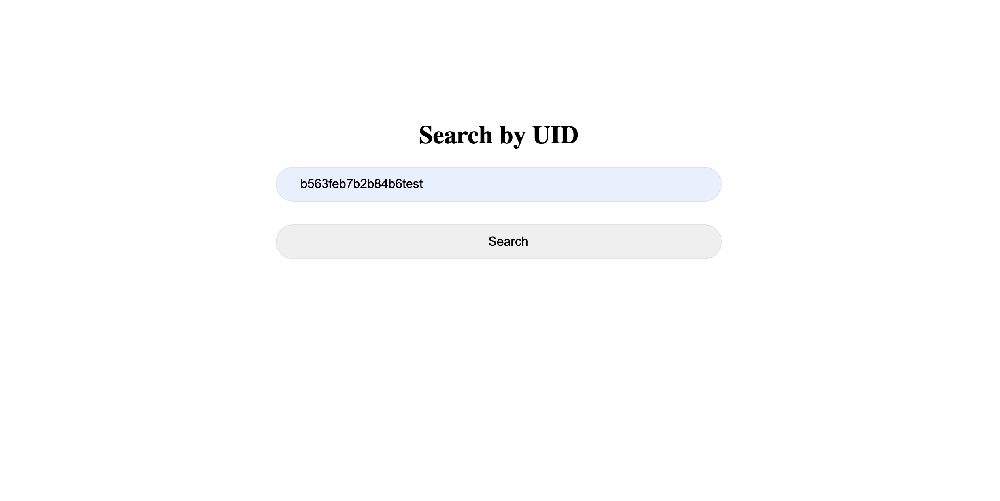
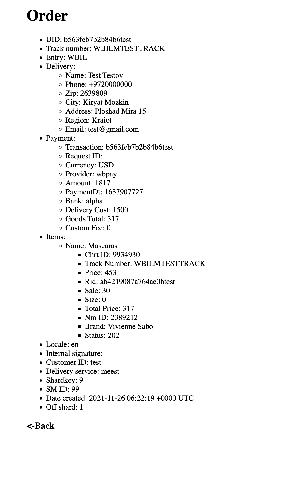

#Wildberries
###Golang internship L0

PREPARATION
------------
Please launch my docker-compose file:

      cd src && docker-compose up

QUICK START
-----------

In order to run service follow next command:

     cd src     
     go run ./service

You can send a message to the server using a script that is located in the publisher folder:
     
     cd publisher && go run publisher.go -path ./data-sets

Check http://127.0.0.1:8888/:

